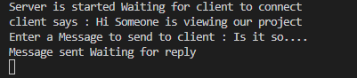

# Java Chat Application

## Sample Output

<div style="display: flex; justify-content: space-between;">
  <div>
    
    <p><strong>Client Output</strong></p>
  </div>
  <div>
    
    <p><strong>Server Output</strong></p>
  </div>
</div>

## Project Overview
This is a simple client-server chat application built using Java’s TCP sockets for communication. The server and client establish a connection and can exchange messages in real-time. It demonstrates two-way communication and socket programming fundamentals.

## Features
- Reliable two-way communication using TCP sockets.
- Simple text-based interface for sending and receiving messages.
- Connection established between server and client on the same network.
- Graceful termination of the chat when either side sends "bye".

## Technologies Used
- **Java**: Core programming language for socket communication.
- **TCP/IP Protocol**: For reliable data transfer between client and server.
- **Scanner & Input/Output Streams**: For reading and sending messages between client and server.

## How to Run

### Server Side:
1. Open a terminal or command prompt.
2. Navigate to the directory containing the server Java file.
3. Compile the server file:
    ```bash
    javac basicserver.java
    ```
4. Run the server:
    ```bash
    java basicserver
    ```
   The server will wait for a client to connect on port `1904`.

### Client Side:
1. Open a terminal or command prompt.
2. Navigate to the directory containing the client Java file.
3. Compile the client file:
    ```bash
    javac basiclient.java
    ```
4. Run the client:
    ```bash
    java basiclient
    ```
   The client will connect to the server and allow two-way messaging.


## Usage
- Start the server first, which will wait for a client to connect.
- Once the client connects, both client and server can send messages to each other.
- To end the conversation, type `bye` from either the client or server.


## Future Improvements
- Implement a graphical user interface (GUI) for easier interaction.
- Add message history or logging functionality to track chat sessions.
- Introduce basic encryption for secure communication.
- **Add multi-client support** by using threading on the server-side to handle multiple clients simultaneously.


## Contributing
Contributions are welcome! Feel free to fork the project, create a new branch, and submit a pull request with your improvements.
